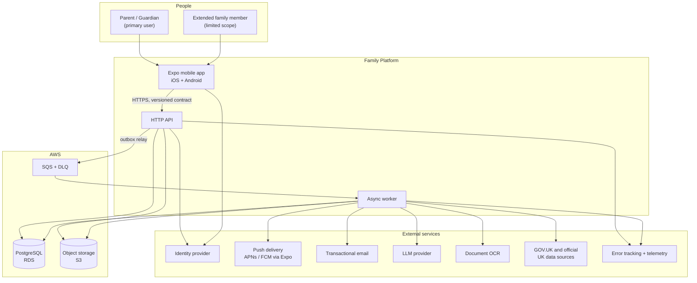
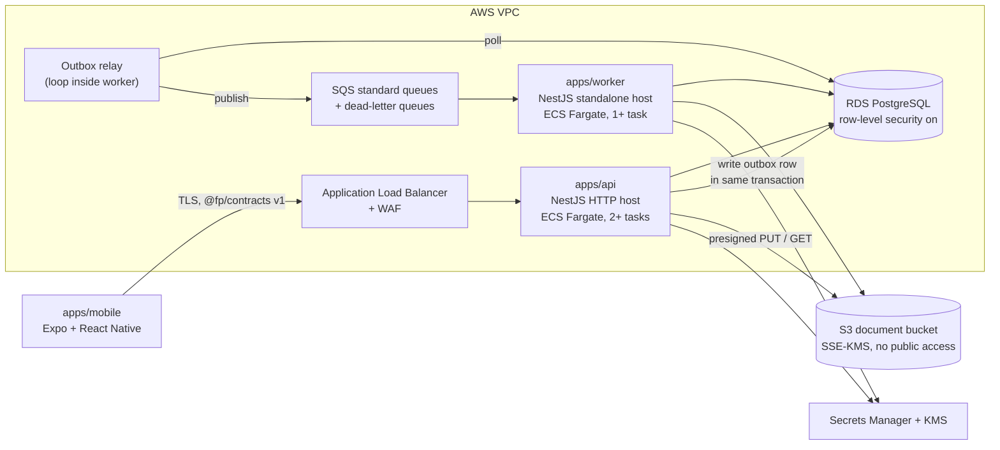
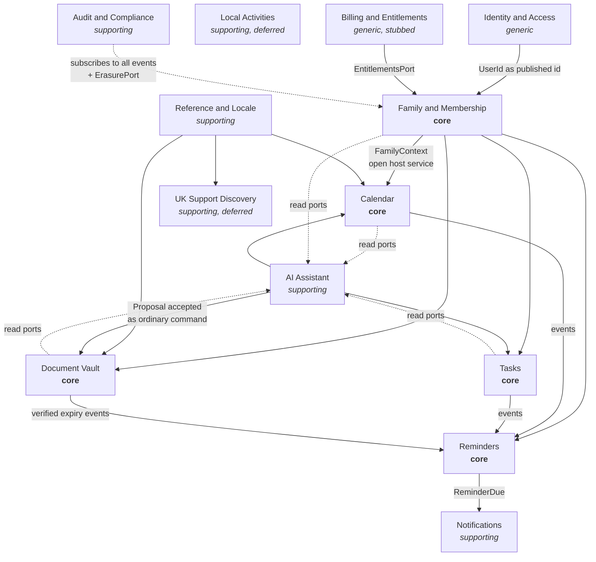
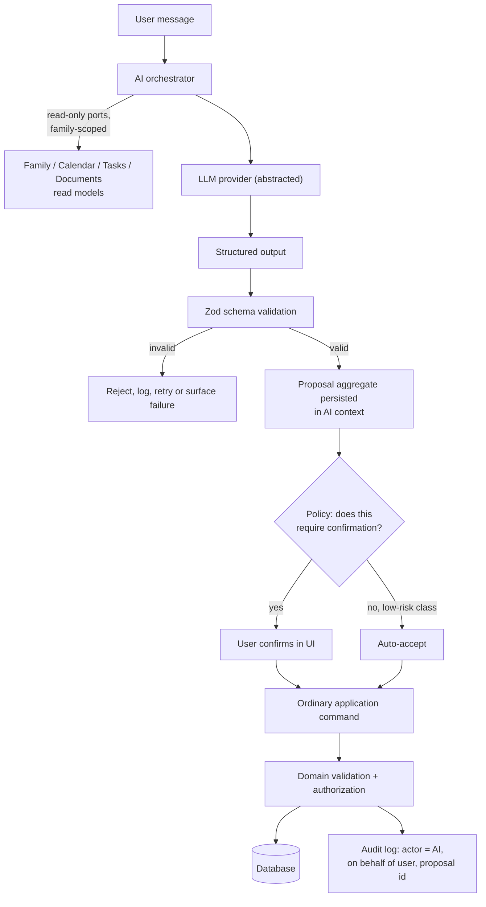
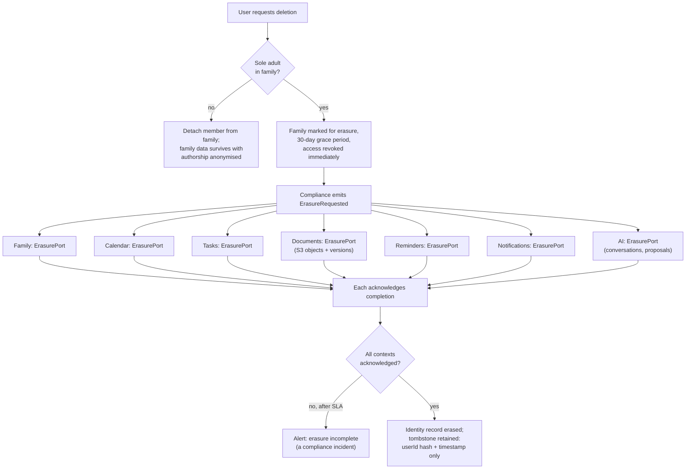
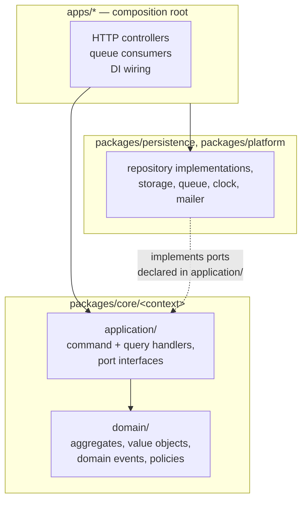
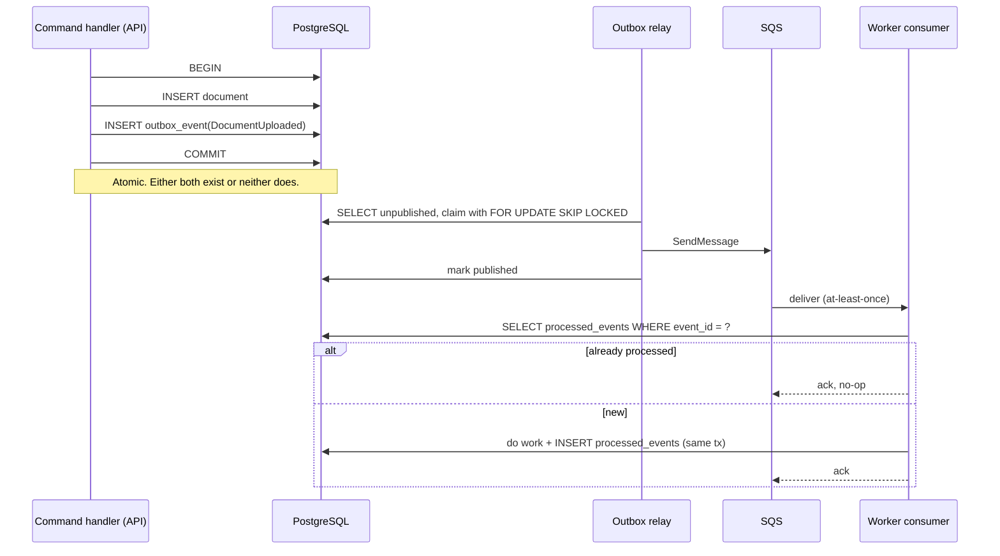
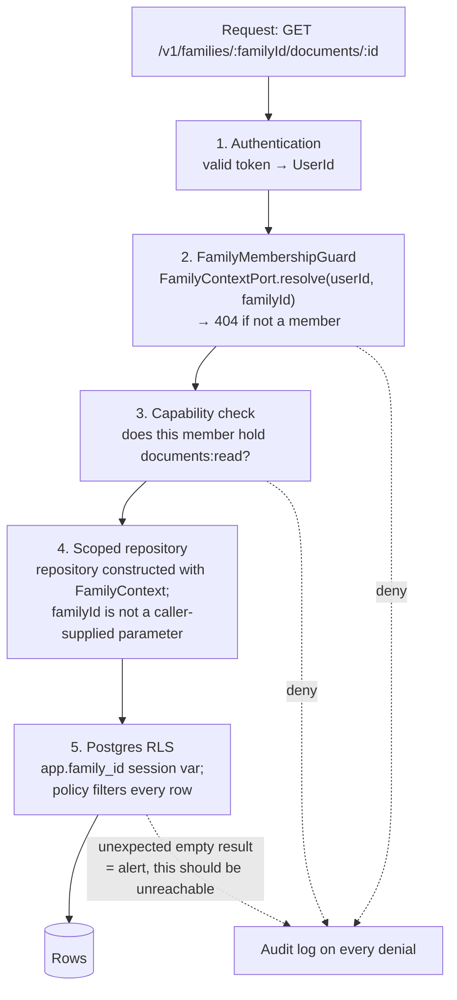

# Architecture

> **Status:** Foundational. This document is normative. Code that contradicts it is a bug, or this document needs an ADR to change it.
> **Scope:** Bounded contexts, module boundaries, dependency direction, and high-level system architecture.
> **Audience:** Engineers and AI coding agents working in this repository. Read this before writing code.

**Naming note.** The product is unnamed. This repository uses the placeholder package scope `@fp/*` (from the repo name `family-platform`). It is deliberately ugly so nobody mistakes it for branding. Renaming the scope later is a single mechanical change and must not require touching this document.

**Framework naming collision.** The backend framework is NestJS. The product must never be called "Nest". Reject any generated identifier that blurs the two.

---

## 1. Architectural position in one paragraph

This is a **modular monolith with a separate asynchronous worker**, built as a **layered hexagonal architecture inside each bounded context**, deployed on AWS from Pulumi TypeScript, with a **Zod-first shared contract** between an Expo mobile client and a NestJS HTTP API. The tenant boundary is the **Family**, enforced in four independent places. The AI subsystem is a strictly downstream consumer that can be deleted without breaking any other part of the platform. Everything asynchronous crosses the process boundary through a **transactional outbox into SQS**, never through a direct call from a request handler.

Each of those choices has an ADR in [adr/](adr/). Where this document states a decision, the ADR carries the reasoning and the rejected alternatives.

---

## 2. Quality attributes that drove the design

Architecture is a response to constraints. These are the ones that actually shaped it, ranked. Anything not on this list did not get to influence a decision.

| # | Driver | Architectural consequence |
|---|---|---|
| 1 | Cross-family data leakage is an extinction event | Family scoping enforced at four layers, including Postgres RLS as a backstop that survives ORM misuse |
| 2 | Children's data is present and especially sensitive | Children are modelled as non-account entities, never as users; access is derived from guardianship, not from ownership |
| 3 | UK GDPR erasure and export must actually work | Compliance context orchestrates an erasure saga; every context implements an erasure port; no context may hide personal data from it |
| 4 | AI must never silently create authoritative state | AI produces `Proposal` aggregates in its own context; domain state changes only via ordinary commands, after validation and (where required) human confirmation |
| 5 | Reminders must be deterministic and auditable | Reminder scheduling is a database sweep over stored rows, not fire-and-forget scheduled callbacks; every reminder traces to the rule and source record that produced it |
| 6 | One developer builds this initially | One deployable unit for synchronous work, one for asynchronous, one language across app and infrastructure, no distributed transactions |
| 7 | Mobile clients live in the wild for months | Explicitly versioned wire contract; no type-inference coupling between a deployed server and an installed app |
| 8 | UK-first, not UK-welded | Locale, jurisdiction and government-service concepts live in a Reference context; no context stores a bare UK-shaped field |
| 9 | Startup cost discipline | Smallest production-ready AWS footprint; managed services chosen where they remove operational work, avoided where they add per-event cost with no benefit yet |

---

## 3. System context



**Boundary rules visible in this diagram.**

- The mobile app talks to exactly one backend surface. There is no direct mobile-to-S3 upload without a server-issued, scoped, short-lived signed URL, and no direct mobile-to-LLM call ever.
- The API never calls an LLM or an OCR service in a request path. Those are worker-only dependencies. This is enforced by package dependencies, not by convention.
- The worker never serves HTTP traffic and is never in a user's latency path.

---

## 4. Container architecture



**Why two deployables and not one, given "modular monolith".** Modular monolith constrains how the *code* is organised, not how many processes run. Document OCR and LLM extraction have a completely different resource profile from an HTTP request: minutes not milliseconds, high memory, bursty, retryable, and tolerant of restarts. Putting them in the API process means a batch of uploaded documents degrades dashboard latency for everyone, and means the API cannot be scaled on request rate alone. The split costs nothing architecturally because both hosts are thin composition roots over the same `@fp/core` package. See [ADR-002](adr/ADR-002-modular-monolith.md).

**What is deliberately absent from the MVP footprint.**

| Component | Verdict | Reason |
|---|---|---|
| CloudFront | Not yet | Documents are served by short-lived presigned S3 URLs to authenticated users. A CDN in front of private per-user objects adds signing complexity and buys nothing until there is public or shared static content. |
| Redis / ElastiCache | Not yet | No session store (stateless tokens), no cache that Postgres cannot serve at this scale. Revisit at the 100k-user tier for dashboard read caching. |
| EventBridge | Not yet | Zero external consumers today. See [ADR-005](adr/ADR-005-event-system.md). |
| API Gateway | No | ALB in front of a long-running container is simpler and cheaper than API Gateway in front of Fargate. |
| Separate admin app | Not yet | Internal operations run through a CLI in the repository plus audited read-only queries. A privileged web console over family data is a large new attack surface and should not exist before it is genuinely needed. |
| Service mesh, Kubernetes | No | There are two services. |

---

## 5. Bounded contexts

A bounded context here means: its own ubiquitous language, its own aggregates, its own database tables that nothing else writes to, and a published interface that everything else must go through. Directory boundaries follow context boundaries exactly.



Solid arrows are runtime dependencies. Dotted arrows into AI are read-only ports. Dotted arrows from Compliance are cross-cutting subscriptions.

### 5.1 Identity and Access — *generic subdomain*

**Responsibility.** Who is holding the phone. Credentials, sessions, refresh and rotation, MFA, device registration, account lifecycle.

**Explicitly not responsible for.** Anything about families, roles within a family, or what a user may see. Authentication answers "who", never "what may they touch".

**Aggregates.** `User`, `Session`, `Device`.

**Key modelling rule.** A `User` has no reference to a `Family`. The relationship is owned entirely by the Family context. This keeps Identity replaceable: it is the strongest candidate for a managed provider (Cognito, Auth0, Clerk, WorkOS), and a managed provider can only ever hold `UserId`, an email, and authentication factors. No family data leaves the platform.

**Publishes.** `UserRegistered`, `UserAuthenticated`, `UserDeletionRequested`.

### 5.2 Family and Membership — *core subdomain, tenant root*

**Responsibility.** The `Family` aggregate is the tenant boundary for the entire platform. It owns members, roles, capabilities, guardianship relationships, invitations, and the household profile (postcode, local authority, composition) that downstream contexts read.

**Aggregates.** `Family` (root), `FamilyMember`, `Invitation`.

**The most important modelling decision in the system.** `FamilyMember` is not a `User`. It is a person the family tracks. A `FamilyMember` *may* be linked to a `UserId` when that person has an account. Children are `FamilyMember` records with no `UserId`, no credentials, and no login path. This is not an implementation shortcut, it is the privacy design: a child's date of birth, school, medical appointments and nursery arrangements are attributes of a record that only guardians can reach, and there is no authentication surface attached to them at all. If a teenager later needs their own account, that is a deliberate `linkUserToMember` command with its own permission model, not an accidental consequence of the schema.

```
Family
├── FamilyMember (adult)   → linked to User
├── FamilyMember (adult)   → linked to User
├── FamilyMember (child)   → no User, guardians: [adult1, adult2]
└── FamilyMember (extended) → linked to User, capability-restricted
```

**Publishes.** `FamilyCreated`, `MemberAdded`, `MemberRoleChanged`, `MemberRemoved`, `GuardianshipEstablished`, `FamilyDeletionRequested`.

**Open Host Service.** Family exposes `FamilyContextPort`, which resolves `(userId, familyId) → { memberId, role, capabilities[] } | null`. Every other context consumes exactly this and nothing more. No context queries family tables directly.

**Roles are coarse; capabilities are what code checks.** Roles (`owner`, `adult`, `extended`, `viewer`) map to capability sets. Authorization code checks capabilities (`documents:read`, `documents:write:sensitive`, `members:manage`, `billing:manage`). Adding a role must never require editing authorization logic scattered across contexts.

### 5.3 Calendar — *core subdomain*

**Responsibility.** Things that happen at a time. Appointments, school and nursery events, activities, birthdays, holidays, deadlines. Recurrence, participants, location, attachments by reference, categories.

**Aggregates.** `CalendarEvent`, `EventOccurrence` (materialised instances of a recurrence within a horizon).

**Why occurrences are materialised.** The dashboard question is "what is happening in the next 14 days across everything". Expanding RRULEs at query time across a family's whole history to answer that is both slow and untestable. A bounded materialisation window, rebuilt when the rule changes, makes the dashboard a plain indexed range query and makes reminder scheduling a plain join. The trade is a background rebuild job and a horizon, both of which are cheap and observable.

**Publishes.** `EventCreated`, `EventUpdated`, `EventCancelled`, `OccurrenceMaterialised`.

### 5.4 Tasks — *core subdomain*

**Responsibility.** Things that must get done, with or without a fixed time. Assignment, due dates, recurrence, priority, completion, categories.

**Aggregates.** `Task`, `TaskAssignment`.

**Why Calendar and Tasks are separate contexts, not one "Planning" context.** They share a shape and almost nothing else. An event is attended and has a duration; a task is completed by someone and has a state machine. Their invariants diverge immediately: a cancelled event still occupies its slot, a completed recurring task spawns its successor, an overdue task escalates, an overdue event does not. Merging them produces an aggregate with two half-used state machines and a `type` discriminator that every method branches on. They are kept apart, and the one genuinely shared concept, recurrence, is extracted into a shared kernel.

**Shared kernel: `@fp/kernel/recurrence`.** An RFC 5545 RRULE value object plus expansion, timezone-correct against Europe/London including DST transitions and UK bank holidays. It is pure, has no dependencies, has exhaustive unit tests, and is the only shared kernel in the system. A shared kernel is a coupling and this one is justified only because it is small, stable, pure, and duplicating it would guarantee two subtly different DST bugs.

**Publishes.** `TaskCreated`, `TaskAssigned`, `TaskCompleted`, `TaskOverdue`.

### 5.5 Document Vault — *core subdomain, highest sensitivity*

**Responsibility.** Storage, versioning, classification and metadata of family documents. Passports, tenancy agreements, insurance, MOT, school letters, government correspondence.

**Aggregates.** `Document` (root), `DocumentVersion`, `ExtractionResult`.

**Critical rule: extraction results are proposals, not facts.** An `ExtractionResult` records what OCR or an LLM believes, with a confidence score and a citation to the region of the source document. It is stored in the Documents context and is *not* a document attribute. `Document.expiresAt` is only ever set by a command, either from user input or from a user confirming a proposal. Nothing downstream, including reminder generation, may read an unconfirmed `ExtractionResult`. This directly implements the product requirement that AI proposes and the domain decides.

**Storage model.** Bytes live in S3 under a key path prefixed by family id, encrypted with SSE-KMS. The database holds metadata and the object key. The API issues presigned URLs scoped to a single object, expiring in minutes, and only after the family authorization check has passed. A presigned URL is a bearer credential, so the expiry is short and every issuance is audited.

**Publishes.** `DocumentUploaded`, `DocumentVersionAdded`, `ExtractionCompleted`, `ExtractionConfirmed`, `DocumentExpiryRecorded`, `DocumentDeleted`.

### 5.6 Reminders — *core subdomain*

**Responsibility.** Deciding what a family should be told about and when. Owns reminder rules, scheduled reminder rows, snoozing, dismissal and escalation.

**Aggregates.** `ReminderRule`, `ScheduledReminder`.

**Why this is its own context and not a feature of Calendar and Tasks.** Reminders is where the product's intelligence lives and it is the thing that must be auditable. It consumes confirmed facts from three contexts and applies explicit, versioned policies: "a passport expiry produces reminders at 9 months, 6 months and 3 months", "an MOT expiry produces one at 4 weeks and one at 1 week". Every `ScheduledReminder` row carries the rule id, rule version, and the source aggregate that triggered it, so the question "why did the app tell me this" always has an answer stored in the database. Scattering that across the source contexts would make the policy set impossible to see, test or change.

**Scheduling mechanism.** A worker sweep queries `ScheduledReminder WHERE fire_at <= now() AND state = 'pending'` on a fixed cadence, claims rows, and emits `ReminderDue`. It does not use per-reminder scheduled callbacks. The reasons are specific: a database sweep is replayable after an outage, inspectable before it fires, cancellable by deleting a row, testable by moving a clock, and it costs nothing. Per-reminder cloud schedulers are none of those things and make "why did this fire" unanswerable. See [ADR-005](adr/ADR-005-event-system.md).

**Publishes.** `ReminderScheduled`, `ReminderDue`, `ReminderDismissed`, `ReminderSnoozed`.

### 5.7 Notifications — *supporting subdomain*

**Responsibility.** Delivery only. Channel selection, per-member preferences, quiet hours, digest batching, push token lifecycle, delivery receipts and failures.

**Aggregates.** `NotificationPreference`, `PushToken`, `NotificationDelivery`.

**Boundary rule.** Notifications never decides *whether* something is worth telling a family. It receives an instruction and delivers it. This separation is what allows "why was I notified" (Reminders) and "why did the notification not arrive" (Notifications) to be debugged independently.

### 5.8 AI Assistant — *supporting subdomain, strictly downstream*

**Responsibility.** Conversations, retrieval over family context through read-only ports, tool orchestration, and the production of `Proposal` aggregates.

**Aggregates.** `Conversation`, `Message`, `Proposal`, `ToolInvocation`.

**The single most important dependency rule in this architecture: nothing depends on AI.** The arrow points AI → domain, never domain → AI. Deleting `packages/ai` and the AI module must leave a fully working product. This is verified by a CI check that builds the API with the AI module excluded.

**The write path.**



There is no path from the LLM to the database that skips `Cmd`. The command handlers the AI uses are the exact same handlers the HTTP controllers use, with the same validation and the same authorization guard, differing only in the recorded actor. A separate "AI write path" would be a second, less-tested implementation of every business rule, and that is how AI systems corrupt data.

**Provider abstraction.** `packages/ai` exposes a `ModelPort` with structured-output and tool-calling capabilities. Provider SDKs are adapters behind it. Prompts are versioned files in the repository, not string literals in code, so a prompt change is a reviewable diff with an evaluation run attached.

### 5.9 UK Support Discovery — *supporting, deferred*

**Responsibility.** A catalogue of official UK support programmes, an eligibility rules engine, and the generation of "you may be eligible to investigate" suggestions with mandatory citation to an official source.

**Non-negotiable rule.** Eligibility output is never phrased as a determination and always carries a source URL and a retrieval date. An LLM may summarise and may help match, but the eligibility rules themselves are deterministic code over a curated programme catalogue, because a hallucinated benefits claim is a real-world harm to a family.

### 5.10 Local Activities — *supporting, deferred*

Recommendations of local family activities considering ages, distance, weather, budget and accessibility. Deferred, and mentioned here only to fix its boundary: it is a read-only recommender that consumes the Family household profile and Reference data, and writes nothing to any other context.

### 5.11 Reference and Locale — *supporting subdomain*

**Responsibility.** `Country`, `Region`, `LocalAuthority`, `PostcodeArea`, `Currency`, `Timezone`, `PublicHoliday`, `GovernmentService`, `SupportProgramme` catalogue entries.

**This is the internationalisation insurance policy.** The requirement was to be UK-first without welding the model to the UK. The mechanism is this: no other context may store a UK-shaped primitive. A family stores `localAuthorityId`, not a council name string. A date rule references `jurisdictionId`, not "England and Wales". Money is `{ amountMinor, currencyCode }`, never a bare number. Expanding to Ireland becomes seeding rows and adding a jurisdiction's rules, not a migration across every table.

Data here is read-mostly, seeded from authoritative sources, and versioned with a retrieval timestamp so we can prove where a fact came from.

### 5.12 Audit and Compliance — *supporting subdomain, cross-cutting*

**Responsibility.** The immutable audit log, consent records, retention policy execution, data export, and account and family erasure orchestration.

**Audit log.** Append-only, no update or delete grants, separate retention from operational data. Every authorization denial, every presigned URL issuance, every access to a child's record by a non-guardian, every AI proposal acceptance, and every administrative action is recorded with actor, subject, family, action, and result.

**Erasure saga.** "Delete my account" is not a `DELETE` statement, and it is not the same operation as "delete my family".



**The architectural obligation this creates.** Every context must implement `ErasurePort.eraseForFamily(familyId)` and `ErasurePort.eraseForMember(memberId)`. A new context is not complete without it, and CI fails if a registered context does not implement it. This is why erasure is a design constraint listed in section 2 rather than a feature: it is the reason no context is allowed to hold personal data outside its own declared tables.

Backups are the honest exception. Point-in-time recovery snapshots cannot be selectively rewritten. The retention policy caps backup age, and any restore triggers a replay of pending erasures. This must be stated in the privacy policy rather than quietly ignored.

### 5.13 Billing and Entitlements — *generic subdomain, stubbed from day one*

Subscriptions are explicitly not an MVP requirement, but the shape of the dependency is decided now, because retrofitting entitlement checks across a mature codebase is a large, error-prone change.

**The rule.** Feature gating never asks "does this family have a subscription". It asks `EntitlementsPort.has(familyId, 'documents.ai_extraction')`. In the MVP the only implementation is `AlwaysEntitled`, which returns true. When billing arrives it becomes a real adapter backed by RevenueCat for mobile store purchases and Stripe for any web purchases, and no call site changes.

Store receipt validation, webhook handling and subscription state live entirely inside this context. No other context ever sees a receipt, a price, or a store product id.

---

## 6. Layering inside a context

Every context has the same four-layer hexagonal shape. This uniformity is deliberate: an agent or engineer opening any context finds the same structure.



**Dependency inversion is the point.** The application layer declares `DocumentRepository` as an interface. `packages/persistence` implements it with Prisma. The application layer never imports Prisma, never imports NestJS, and never imports an AWS SDK. This is enforced mechanically, not by review, as described in section 8.

**Layer rules.**

| Layer | May import | May never import |
|---|---|---|
| `domain/` | `@fp/kernel` only | Anything else. No I/O, no framework, no ORM, no clock, no randomness |
| `application/` | its own `domain/`, `@fp/kernel`, other contexts' *published ports* | Any other context's `domain/`, any infrastructure package, NestJS, Prisma, AWS SDK |
| `packages/persistence` | `@fp/core`, `@fp/kernel`, Prisma | `@fp/contracts`, `@fp/ai`, any app |
| `packages/platform` | `@fp/kernel`, AWS SDK, provider SDKs | `@fp/core`, `@fp/persistence` |
| `apps/*` | everything | other apps |

**Where NestJS lives.** Only in `apps/api` and `apps/worker`. NestJS is a composition and transport framework here, not an application framework. Business logic in a `@Injectable()` that imports `@nestjs/common` is untestable without a DI container and unextractable later. `packages/core` has no NestJS dependency in its `package.json`, which makes the rule unbreakable rather than merely discouraged.

**Domain purity has a practical payoff.** Domain tests need no database, no container, no mocking framework and no clock stub beyond an injected `Clock` port. Recurrence, reminder policies, eligibility rules, permission resolution and document classification are all pure functions over value objects. That is where the majority of the test suite should live, and it runs in under a second.

---

## 7. Cross-context communication

Three mechanisms, in strict order of preference.

### 7.1 Synchronous read through a published port (preferred for queries)

Context A needs data from context B *now*, read-only. B exposes a narrow port in its application layer; A depends on the interface. The host wires the real implementation.

```ts
// packages/core/family/application/ports/family-context.port.ts
export interface FamilyContextPort {
  resolve(userId: UserId, familyId: FamilyId): Promise<FamilyContext | null>;
}
```

This is an in-process function call. It is allowed because it does not create a write coupling and because extracting B later turns this port into an HTTP or gRPC adapter without touching A.

**Forbidden variant.** A importing B's repository, B's Prisma model, or B's domain types. If A needs B's data shape, B publishes a DTO in its port signature. That DTO is B's published language and B owns its evolution.

### 7.2 Domain events within a transaction (preferred for same-context invariants)

Aggregates record domain events. The command handler dispatches them after the aggregate is persisted, inside the same database transaction. Handlers may only touch the same context. Use this for derived state within a context: materialising occurrences after a recurrence rule changes, recomputing a task's next instance on completion.

### 7.3 Integration events via the transactional outbox (mandatory for cross-context side effects)

Any effect that crosses a context boundary and is not a pure read goes through the outbox. The command handler writes the domain change and an `outbox_event` row in one transaction. A relay publishes to SQS. Consumers are idempotent, keyed on event id.



**Why the outbox is mandatory and not optional.** The failure it prevents is specific and severe for this product. Without it, a document row is committed and the "process this document" message publish fails, so a family's passport sits in the vault, silently never scanned, no expiry detected, no reminder created, and nothing anywhere reports an error. The family finds out at an airport. The outbox converts that class of silent loss into an at-least-once guarantee, and idempotent consumers convert at-least-once into effectively-once. The cost is one table, one polling loop, and a discipline rule. Full reasoning in [ADR-005](adr/ADR-005-event-system.md).

**Event naming and versioning.** Past tense, context-prefixed, explicitly versioned: `documents.DocumentUploaded.v1`. Payloads carry ids and the minimum data a consumer needs, never whole aggregates, and never sensitive content. A consumer that needs more calls a read port. Schema changes within a version are additive only; anything else is a new version published alongside the old until consumers migrate.

---

## 8. Repository structure and module boundaries

```
family-platform/
├── AGENTS.md                    # how AI coding agents must work here
├── ARCHITECTURE.md              # this file
├── CONSTITUTION.md              # engineering principles, including the AI constitution
├── SECURITY.md  PRIVACY.md  CONTRIBUTING.md
│
├── adr/                         # architecture decision records, immutable once accepted
├── specs/                       # source of truth for behaviour
│   ├── product/ domain/ api/ mobile/ ai/ security/ infrastructure/ testing/
├── docs/                        # explanatory material, runbooks, onboarding
├── diagrams/                    # mermaid sources referenced from docs
│
├── docker-compose.yml           # the local service set: postgres, migrate, api (ADR-014)
│
├── apps/
│   ├── api/                     # NestJS HTTP host. Thin. Controllers, guards, DI wiring.
│   │   └── Dockerfile           #   base -> deps -> {development, runtime, migrator}.
│   │                            #   The artifact every environment runs from.
│   ├── worker/                  # NestJS standalone host. Queue consumers, sweeps, relay.
│   └── mobile/                  # Expo. Screens, navigation, native config.
│
├── packages/
│   ├── kernel/                  # pure, dependency-free: Result, branded ids, errors,
│   │                            #   Clock port, Money, recurrence (shared kernel)
│   ├── core/                    # ALL bounded contexts. No framework, no ORM, no I/O.
│   │   ├── family/{domain,application}
│   │   ├── calendar/{domain,application}
│   │   ├── tasks/{domain,application}
│   │   ├── documents/{domain,application}
│   │   ├── reminders/{domain,application}
│   │   ├── notifications/{domain,application}
│   │   ├── reference/{domain,application}
│   │   ├── compliance/{domain,application}
│   │   └── billing/{domain,application}
│   ├── persistence/             # Prisma schema, migrations, repository implementations
│   ├── platform/                # infra adapters: SQS, S3, KMS, mailer, push, flags,
│   │                            #   logger, tracing, config loading
│   ├── contracts/               # ts-rest + Zod wire contracts, versioned. The API boundary.
│   ├── api-client/              # typed client + TanStack Query hooks, built on contracts
│   ├── ai/                      # ModelPort, prompts, tools, guardrails, evaluations
│   ├── ui/                      # mobile design system
│   ├── testing/                 # factories, fixtures, testcontainers harness
│   └── config-*/                # eslint, typescript, prettier shared configs
│
├── infrastructure/              # Pulumi TypeScript, part of the same workspace
└── .github/workflows/
```

### 8.1 Package count is a deliberate decision

The original blueprint proposed `types`, `validation`, `auth`, `database`, `observability` and `domain` as separate packages. That is rejected as sprawl. Each package is a build node, a version, a tsconfig, a lint config and a set of cross-imports to reason about, and packages named after technical layers rather than responsibilities encourage exactly the wrong coupling.

| Proposed package | Verdict | Where it went |
|---|---|---|
| `types` | Rejected | Types belong with the code that owns them. A shared `types` package becomes a dumping ground that every package depends on, guaranteeing a rebuild of everything on any change. |
| `validation` | Rejected | Wire validation is `contracts`. Domain invariants are value objects in `core`. There is no third kind. |
| `auth` | Rejected | Authentication adapters are `platform`. Authorization is `core/family` capabilities plus a guard in `apps/api`. Splitting it hides where the decision is made. |
| `database` | Renamed | `persistence`, and it holds repository implementations too, not just a client. A package that exports a bare ORM client invites every other package to import it. |
| `observability` | Merged | Part of `platform`. It is three adapters, not a package. |
| `domain` | Restructured | `core`, containing every context, each with its own `domain` and `application` folders. |

**Why all contexts share one `core` package rather than one package each.** A package per context would give stronger boundaries, and it is the right answer for a team of thirty. For one developer it multiplies build configuration by nine and makes cross-context refactoring painful enough that people avoid doing it. The compromise is that contexts are folders inside `core` with boundaries enforced by lint rules at equal strength, and promoting a context to its own package later is a directory move plus a `package.json`. The boundary discipline is identical; only the enforcement mechanism differs.

### 8.2 How boundaries are actually enforced

Four layers, in increasing order of strength.

1. **Code review.** Weakest. Assumed to fail.
2. **ESLint `no-restricted-imports` zones.** Configured per directory. `packages/core/*/domain/**` may import only from `@fp/kernel` and its own context. Cross-context imports of anything except `application/ports/**` are errors.
3. **`dependency-cruiser` in CI.** Detects circular dependencies, validates the full allowed-edge graph from section 6, and fails the build on violation. It sees what ESLint's per-file view cannot: a cycle spanning four files across three packages.
4. **`package.json` dependency absence.** Strongest, because it is not a rule that can be disabled with a comment. `@fp/core` does not list `@prisma/client`, `@nestjs/common`, or any `@aws-sdk/*` as a dependency. Under pnpm's strict, non-hoisted `node_modules`, importing them is a resolution failure, not a lint warning. This is a large part of why pnpm is chosen over npm or yarn in [ADR-001](adr/ADR-001-monorepo-tooling.md).

An additional CI job builds `apps/api` with the AI module removed, verifying the "nothing depends on AI" rule empirically rather than aspirationally.

---

## 9. Family isolation: defence in depth

The stated top risk is that a user reaches another family's data by changing an id. One mechanism is not enough, because the realistic failure is a single forgotten `where` clause in one of several hundred queries. Four independent layers, each of which alone would prevent the breach.



**Layer 4 is the one that prevents the common bug.** Repositories are not global singletons taking a `familyId` argument that a developer can forget. They are constructed per request from the resolved `FamilyContext`, and their method signatures have no family parameter at all. `documentRepository.findById(documentId)` is scoped by construction. There is no way to express the unscoped query in the repository API.

**Layer 5 is the one that catches the mistake anyway.** Postgres row-level security policies on every family-scoped table, driven by a session variable set at the start of each transaction. It is ORM-independent, so it survives a raw query, a future ORM migration, an ad-hoc script, and a developer who bypasses the repository. It costs a `SET LOCAL` per transaction.

**Return 404, not 403, for cross-family access.** A 403 confirms the resource exists, which is an enumeration oracle. The audit log records the true reason.

**Children get an additional check.** Access to a `FamilyMember` marked as a child requires an active guardianship relationship, not merely family membership. An extended family member in the family cannot read a child's medical appointments by default. Every such access is audited.

---

## 10. Data architecture principles

Full schema lives in `specs/domain/`. The architectural rules that constrain it:

**Single database, schema-per-context boundaries.** One Postgres instance, one logical database. Each context owns a set of tables and no other context writes to them. Cross-context foreign keys are permitted only to ids that the target context publishes as stable (`family_id`, `family_member_id`, `user_id`); they are forbidden to internal entities. This is what makes a later extraction a bounded piece of work rather than an archaeology project.

**`family_id` on every family-scoped table.** Not derivable by join. Denormalised deliberately, because it is what RLS policies and scoped indexes need, and a join-derived tenant key is a tenant key that can be forgotten.

**Identifiers.** UUIDv7 primary keys. Time-ordered, so they index well and do not fragment B-trees like UUIDv4, while remaining non-enumerable, unlike sequential integers. Branded TypeScript types (`FamilyId`, `DocumentId`) make passing a `TaskId` where a `DocumentId` is expected a compile error.

**Deletion.** Soft delete for user-recoverable content (tasks, events, documents in a 30-day bin). Hard delete for compliance erasure. Soft-deleted rows are excluded by the repository layer *and* by an RLS predicate, because a soft delete that only the ORM honours will eventually leak through a report query.

**Money and time.** Money is always `{ amountMinor: bigint, currencyCode }`. Timestamps are always `timestamptz` stored in UTC. Anything a user sees a date for also stores the IANA timezone it was authored in, because "the nursery closes at 6pm" must not shift by an hour across a DST boundary.

**Migrations.** Plain SQL files, generated by Prisma, reviewed in the pull request, applied by a dedicated migration task before the new application version starts. Expand-and-contract for anything destructive: add, backfill, dual-write, switch reads, then drop in a later release. A migration that drops or renames a column in the same deployment that stops using it cannot be rolled back. See [ADR-003](adr/ADR-003-database-orm.md).

---

## 11. API architecture summary

REST over HTTP/JSON. Contract-first with Zod schemas in `packages/contracts`, bound with ts-rest, consumed by both the NestJS server and the Expo client, and emitted as OpenAPI for documentation. Path-versioned at `/v1`. Rejected: GraphQL, primarily because a traversable graph over family-scoped data multiplies the authorization surface that section 9 must protect. Rejected: the NestJS class-validator plus Swagger-decorator default, because it maintains two parallel type systems that drift. Full reasoning in [ADR-006](adr/ADR-006-api-style-and-type-safety.md).

**One deviation from strict resource REST, stated explicitly.** `GET /v1/families/:id/dashboard` is a purpose-built aggregate endpoint returning today, upcoming, urgent tasks, expiring documents and alerts in one round trip. A mobile home screen assembled from six parallel requests over a poor connection is a worse product, and this is precisely the case people reach for GraphQL to solve. One well-tested, cacheable, authorization-checked endpoint is the cheaper answer. Additional aggregate endpoints require justification in the pull request, because the failure mode is a proliferation of screen-shaped endpoints.

---

## 12. Extraction playbook

The modular monolith is a starting point, not a permanent commitment. These are the pre-agreed triggers and the pre-agreed first candidates. Extraction without a trigger is speculative complexity.

| Candidate | Trigger | Difficulty |
|---|---|---|
| Document processing pipeline | Sustained OCR/LLM cost or latency that Fargate autoscaling on the shared worker cannot isolate | Low. Already an independent queue consumer with no synchronous callers. |
| AI Assistant | Materially different scaling profile, or a need to run it under separate compliance controls | Low. Already read-port-only and event-driven. |
| Identity | A decision to adopt a managed provider | Low, by design. Holds no family data. |
| Notifications delivery | Push volume requiring independent throughput | Low. Pure consumer. |
| Calendar or Tasks | None foreseen | High, and it should stay high. These are the core domain and they are chatty with Family. |

**The extraction procedure.** Replace the in-process port implementation with an HTTP or queue adapter behind the same interface, move the tables to their own database, replace cross-context foreign keys with published ids and eventual consistency, and move the code directory to its own package and deployable. The interfaces that make this possible are the ones defined in section 7. They exist for this reason and are not optional abstraction.

**What would tell us we got the boundaries wrong.** A steady stream of features that require coordinated changes across three or more contexts, or a context whose port surface keeps growing because callers need more of its internals. Both are signals to merge contexts, not to add abstraction.

---

## 13. Related decision records

| ADR | Decision |
|---|---|
| [ADR-001](adr/ADR-001-monorepo-tooling.md) | pnpm workspaces + Turborepo, with lint-enforced boundaries |
| [ADR-002](adr/ADR-002-modular-monolith.md) | Modular monolith, two deployables, pre-agreed extraction seams |
| [ADR-003](adr/ADR-003-database-orm.md) | PostgreSQL with Prisma, RLS-backed isolation, defined escape hatch to Kysely |
| [ADR-004](adr/ADR-004-infrastructure-as-code.md) | Pulumi TypeScript on AWS |
| [ADR-005](adr/ADR-005-event-system.md) | Domain events, transactional outbox, SQS; EventBridge deferred |
| [ADR-006](adr/ADR-006-api-style-and-type-safety.md) | REST with ts-rest and Zod contracts; GraphQL rejected |
