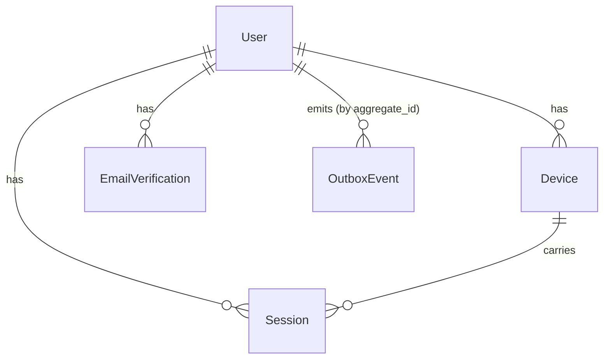

# Data Model: Identity and Access (spec 006)

Phase 1 output. Every field below traces to a functional requirement or to spec.md's Personal Data,
Deletion and Export section — the constitution's Principle VI requires each stored field to be
justified by a purpose, and "it might be useful later" is not one.

**None of these tables are family-scoped.** That is deliberate and structural (FR-018): a `User`
answers who someone is, never what they may touch. Principle V's row-level security applies to
family-scoped tables, and these are declared explicitly outside that set — see
[plan.md](plan.md)'s Complexity Tracking.

---

## Aggregates and their tables

### `User` — aggregate root

| Field | Type | Purpose / requirement |
|---|---|---|
| `id` | `UserId` (branded UUID) | The published identifier other contexts will reference. The only field a future context may hold |
| `email` | citext, unique | Account identifier and the sole contact channel (FR-001). Unique index is on the normalised form, giving FR-022's case-insensitivity |
| `password_hash` | text | argon2id digest (FR-005). Never the plaintext, never reversible |
| `status` | enum | `pending_verification` \| `active` \| `deletion_requested`. Drives FR-003, FR-016 |
| `email_verified_at` | timestamptz, null | Set on successful verification (FR-003) |
| `deletion_requested_at` | timestamptz, null | Starts the FR-019 retention clock |
| `failed_attempt_count` | int | FR-008 throttling counter |
| `throttled_until` | timestamptz, null | FR-008. Checked before any credential comparison, so throttling costs no argon2id work |
| `created_at` / `updated_at` | timestamptz | Audit and FR-020's retention clock. UTC, per the UK-first-not-UK-welded constraint |

**Invariants.** An email is unique across *all* statuses including `deletion_requested`, which is
what makes FR-002's "blocked until erasure completes" true at the database level rather than in
application logic. A `User` holds no reference to any family, role or capability — enforced by the
absence of such a column, not by convention.

**State transitions.**

```
register ──▶ pending_verification ──verify──▶ active ──request deletion──▶ deletion_requested
                     │                                                             │
                     └────── 30-day sweep (FR-020) ──▶ erased                      │
                                                        30-day sweep (FR-019) ◀────┘
```

There is no path back from `deletion_requested`. Undeleting is not a requirement, and adding it
later is a new command with its own decision, not a status flip.

---

### `Session` — aggregate root

| Field | Type | Purpose / requirement |
|---|---|---|
| `id` | `SessionId` (branded UUID) | The **stable identity** that survives rotation (spec.md clarification 2). This is what "log out this device" revokes |
| `user_id` | `UserId` FK | Owner. Indexed — a user listing their sessions is a routine query |
| `device_id` | `DeviceId` FK | Which client this session belongs to (FR-009) |
| `token_hash` | bytea, unique index | SHA-256 of the current opaque credential. **Never the token itself** |
| `previous_token_hash` | bytea, null, indexed | The immediately-superseded credential, retained for FR-011's replay detection |
| `issued_at` | timestamptz | When the session began |
| `rotated_at` | timestamptz, null | Last rotation (FR-010) |
| `absolute_expires_at` | timestamptz | FR-013's hard ceiling. Renewal past this is refused |
| `revoked_at` | timestamptz, null | FR-012, FR-015. Presence of this value fails the FR-023 check |
| `revoked_reason` | enum, null | `user_revoked` \| `account_deleted` \| `replay_detected`. Distinguishing these is what makes a replay incident visible rather than indistinguishable from a normal logout |

**Why `token_hash` and not the token.** A database disclosure must not hand over live sessions.
SHA-256 with no work factor is correct here and wrong for passwords: the token is 256 bits of
uniform randomness, so there is no dictionary to attack, and a slow KDF would tax every
authenticated request for no gain. Reasoning in [research.md §3](research.md).

**Why only *one* previous hash.** Replay detection needs to distinguish "a superseded credential"
from "a credential that never existed." Keeping the immediately-prior hash catches the realistic
case — a stolen token replayed after the legitimate client has rotated — with bounded storage. A
full rotation history would grow without limit for no additional detection power.

**State transitions.**

```
issue ──▶ active ──rotate──▶ active (same SessionId, new token_hash)
            │                    │
            ├── revoke ──────────┴──▶ revoked  (FR-012 / FR-015)
            ├── replay detected ─────▶ revoked  (FR-011, whole lineage)
            └── absolute_expires_at passed ──▶ expired (FR-013)
```

Rotation never produces a new `SessionId`. That single fact is what makes FR-012 a reliable action
rather than a race against a background renewal.

---

### `Device`

| Field | Type | Purpose / requirement |
|---|---|---|
| `id` | `DeviceId` (branded UUID) | |
| `user_id` | `UserId` FK | |
| `label` | text | A human-recognisable name so a user can tell their sessions apart (FR-009) |
| `first_seen_at` / `last_seen_at` | timestamptz | Lets a user judge whether a session is theirs |

**Deliberately minimal.** spec.md states this is "not a fingerprinting or tracking mechanism." No
IP address, no user agent string, no hardware identifier — those would be personal data collected
without a purpose that Principle VI would accept. FR-009 requires session issuance to proceed even
when this information is poor, so every field but the identifiers is best-effort.

---

### `EmailVerification`

| Field | Type | Purpose / requirement |
|---|---|---|
| `id` | UUID | |
| `user_id` | `UserId` FK | |
| `token_hash` | bytea, unique | Hashed for the same reason as a session token — the link is a bearer credential |
| `expires_at` | timestamptz | FR-003a's expiry window |
| `consumed_at` | timestamptz, null | Single use |
| `superseded_at` | timestamptz, null | Set when a resend issues a replacement, implementing FR-003a's "each new request invalidates the previously issued link" |

A resend writes a new row and supersedes the old one, rather than mutating in place, so "how many
times did this person ask for a link" stays answerable — the observability constraint says a
feature that cannot answer "what happened" for a specific user's action is not finished.

---

### `OutboxEvent`

| Field | Type | Purpose / requirement |
|---|---|---|
| `id` | UUID | Event identity; the idempotency key a future consumer will key on |
| `event_type` | text | `UserRegistered` \| `UserAuthenticated` \| `UserDeletionRequested` (FR-017) |
| `aggregate_type` / `aggregate_id` | text / UUID | What it happened to |
| `payload` | jsonb | **Identifiers and correlation metadata only.** No email address, no name, nothing personal — Principle VIII states this directly, and Principle VI forbids personal data in queue payloads |
| `occurred_at` | timestamptz | |
| `published_at` | timestamptz, null | Always null at this stage: no relay exists yet ([research.md §5](research.md)). The column exists now so the relay is a consumer of this table rather than a migration of it |
| `correlation_id` | text | Ties the event to the request that caused it |

**Written in the same transaction as the state change that caused it.** That is ADR-005's Layer 2
rule and the whole reason the table exists — a `COMMIT` followed by a separate publish is the
silent-loss failure the outbox prevents.

---

## Relationships



`OutboxEvent` has no foreign key to `User` on purpose: it must survive the erasure of the account
it refers to, carrying only an identifier. A foreign key would either block erasure or cascade away
the audit trail, and both are wrong.

---

## Retention and erasure

Implemented as scheduled sweeps in `apps/worker`, per ADR-002's assignment of "scheduled sweeps" to
that host. Each sweep is idempotent and re-runnable.

| Sweep | Selects | Action | Requirement |
|---|---|---|---|
| Unverified registrations | `status = pending_verification AND created_at < now() - 30d` | Delete `User` and its verification rows | FR-020 |
| Deleted accounts | `deletion_requested_at < now() - 30d` | Delete `User`, sessions, devices, verifications. `OutboxEvent` rows survive, holding identifiers only | FR-019 |
| Stale sessions | `revoked_at < now() - 90d OR absolute_expires_at < now() - 90d` | Delete the `Session` row | spec.md Personal Data §5 |

A sweep that fails to complete within its window raises an alert and is treated as a compliance
incident, not a failed job — Principle XI requires exactly that framing.

---

## Export

FR-021's export contains: email address, registration date, verification status, and per-session
device label with issued and revoked timestamps.

It never contains `password_hash`, `token_hash`, `previous_token_hash` or any verification token.
Each of those is either a credential or a usable bearer token, and exporting one would be a
disclosure dressed as a data-subject right.
